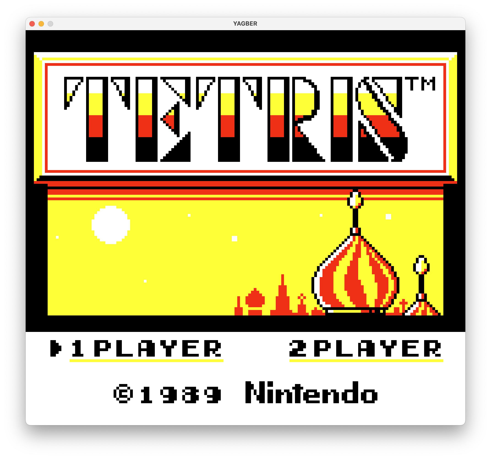

# YAGBER

[](https://www.rust-lang.org/)
[](https://github.com/EMachad0/YAGBER/actions/workflows/tests.yml)
[](https://github.com/EMachad0/YAGBER/actions/workflows/clippy.yml)
[](https://github.com/EMachad0/YAGBER/blob/main/LICENSE)

### Yet Another Game Boy Emulator in Rust

YAGBER is a Game Boy emulator written in Rust. It is a work in progress and not yet fully functional.

Currently it only runs from the command line, no binary is provided yet.

```bash
cargo run --release --bin yagber -- --rom path/to/rom.gb
```

## Game Support

Tetris from 1989 for the original Game Boy is fully functional.



Many other games are not yet functional due to the (soon) to implemented MBC2 and above support.

## Testing

This emulator is tested against a set of test ROMs that were verified to work in real hardware.

It passes all instruction tests from the [Blaarg's test ROMs](https://github.com/retrio/gb-test-roms).

See [docs/testing.md](docs/testing.md) for more information about the tests.

See [docs/scripts.md](docs/scripts.md) for more information about running the scripts present in the `scripts` directory.
