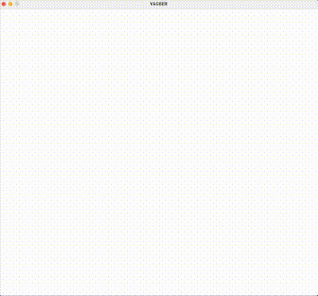

# YAGBER

[](https://www.rust-lang.org/)
[](https://github.com/EMachad0/YAGBER/actions/workflows/tests.yml)
[](https://github.com/EMachad0/YAGBER/actions/workflows/clippy.yml)
[](https://github.com/EMachad0/YAGBER/blob/main/LICENSE)

## Yet Another Game Boy Emulator in Rust

YAGBER is a Game Boy emulator written in Rust.

Currently it only runs from the command line, no binary is provided yet.

```bash
cargo run --release path/to/rom.gb
```

## Demos
> Boot Gif



> YouTube Demos

[](https://youtu.be/0j8q8r7bTNw)

[](https://youtu.be/pWixMjAkd6k)

## Game Support

YAGBER supports cartridges without MBCs(Memory Bank Controllers) or with MBCs 1, 2, 3 or 5. This account to the vast majority of oficially released game boy color games but there are other exotic games that use other MBCs types and thus are not yet supported.

See [docs/compatibility.md](docs/compatibility.md) for more information, including a list with imcompatible games.

## Testing

This emulator is tested against a set of test ROMs that were verified to work in real hardware.

It passes all instruction tests from the [Blaarg's test ROMs](https://github.com/retrio/gb-test-roms).

See [docs/testing.md](docs/testing.md) for more information about the tests.

See [docs/scripts.md](docs/scripts.md) for more information about running the scripts present in the `scripts` directory.
